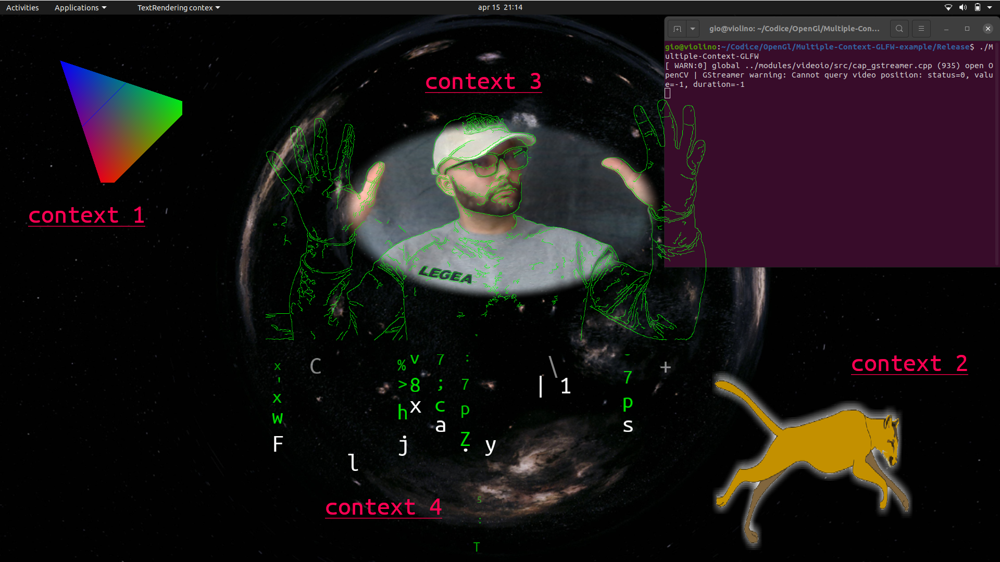

# Multiple-Contex-GLFW-example
Example using my utility [MyContex](https://github.com/musicrizz/MyContext) to create Multiple OpenGL contex with glfw3.  
In this application I create 4 context with undecorated window and trasparent framebuffer.

* Context 1 : Simple Trinagle
* Context 2 : Point Sprite
* Context 3 : Camera Texture
* Context 4 : Matrix Text Rendering

*if you press space bar the Context 4 will be full screen.*

   

This is a cpp project with Eclipse.  
Required lib :   
* GL
* GLEW
* glfw
* glm
* OpenCV
* freeType
